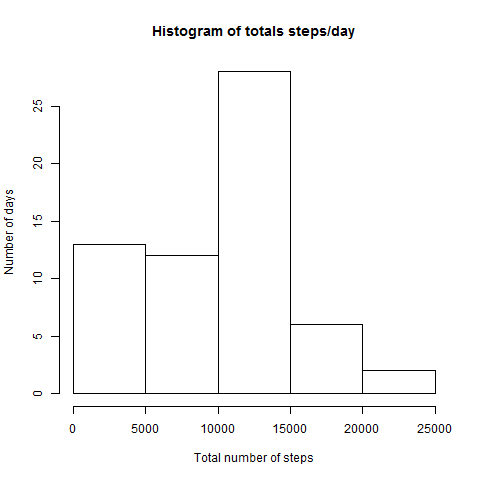
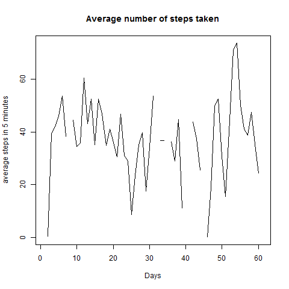
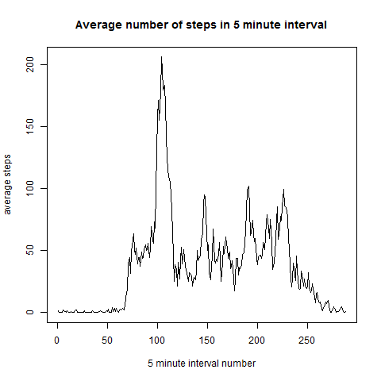
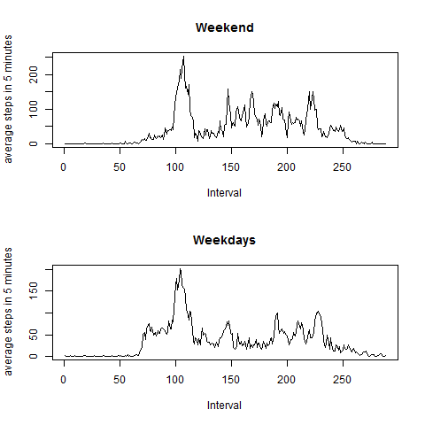

#Coursera markdown - Course Project 1
by Anders Kramer Knudsen

###1.Code for reading in the dataset and/or processing the data


```r
temp <- tempfile()
download.file("https://d396qusza40orc.cloudfront.net/repdata%2Fdata%2Factivity.zip",temp, mode="wb")
unzip(temp, "activity.csv")
df <- read.table("activity.csv", sep=",", header=T, text="")
a<-tapply(df$steps,df$date,sum,na.rm=T)
```


###2.Histogram of the total number of steps taken each day


```r
hist(a, xlab="Total number of steps", ylab="Number of days", main="Histogram of totals steps/day")
```



```r
dev.copy(png,"./figure/2.png")
```

```
## png 
##   3
```

```r
dev.off()
```

```
## png 
##   2
```

(for the period from 1/10/2012 to 30/11/2012)


###3.Mean and median number of steps taken each day


```r
mean(a)
```

```
## [1] 9354.23
```

```r
median(a)
```

```
## [1] 10395
```

The mean of steps: 9354.2295082 steps. The median of steps: 10395 steps


###4.Time series plot of the average number of steps taken


```r
b<-ts(as.vector(tapply(df$steps,df$date,mean,na.rm=T)))
plot(b, xlab="Days", ylab="average steps in 5 minutes", main="Average number of steps taken")
```



```r
dev.copy(png,"./figure/4.png")
```

```
## png 
##   3
```

```r
dev.off()
```

```
## png 
##   2
```


###5.The 5-minute interval that, on average, contains the maximum number of steps


```r
m<-tapply(df$steps, df$interval, mean, na.rm=T)
plot(m, type="l", xlab="5 minute interval number", ylab="average steps", 
     main="Average number of steps in 5 minute interval")
```



```r
dev.copy(png,"./figure/5.png")
```

```
## png 
##   3
```

```r
dev.off()
```

```
## png 
##   2
```

```r
names(which(m == max(m)))
```

```
## [1] "835"
```

```r
max(m)
```

```
## [1] 206.1698
```

The 5-minute interval that, on average, contains the maximum number of steps is: 835. It has an average of 206.1698113 steps.


Extras...


```r
library(dplyr)
m<-max(df$steps, na.rm=T)
c<-filter(df, steps==m)
```

Overall the 5-minute interval is 615 on the 2012-11-27. Maximum was 806 steps.


###6.Code to describe and show a strategy for imputing missing data

Impute missing values by inserting 5-minute interval average as the value for each 5 minute interval with missing values


```r
a<-tapply(df$steps,df$interval,mean,na.rm=T)

n<-sum(is.na(df$steps))

df$steps[is.na(df$steps)]<-a
```

Before imputing missing values there where 2304 missing values.

###7.Histogram of the total number of steps taken each day after missing values are imputed


```r
a<-tapply(df$steps,df$date,sum,na.rm=T)
hist(a, xlab="Total number of steps", ylab="Number of days", 
     main="Histogram of totals steps/day")
```



```r
dev.copy(png,"./figure/7.png")
```

```
## png 
##   3
```

```r
dev.off()
```

```
## png 
##   2
```


###8.Panel plot comparing the average number of steps taken per 5-minute interval across weekdays and weekends


```r
library(lubridate)
library(lattice)
df$wd<-wday(ymd(as.Date(df$date)))
df$weekend[df$wd>5]="Weekend"
df$weekend[df$wd<=5]="Weekday"
df$weekend<-as.factor(df$weekend)

b<-ts(as.vector(tapply(df$steps[df$weekend=="Weekend"],df$interval[df$weekend=="Weekend"],mean,na.rm=T)))
c<-ts(as.vector(tapply(df$steps[df$weekend=="Weekday"],df$interval[df$weekend=="Weekday"],mean,na.rm=T)))

par(mfrow=c(2,1))
plot(b, xlab="Interval", ylab="average steps in 5 minutes", main="Weekend")
plot(c, xlab="Interval", ylab="average steps in 5 minutes", main="Weekdays")
```


```r
dev.copy(png,"./figure/8.png")
```

```
## png 
##   3
```

```r
dev.off()
```

```
## png 
##   2
```
